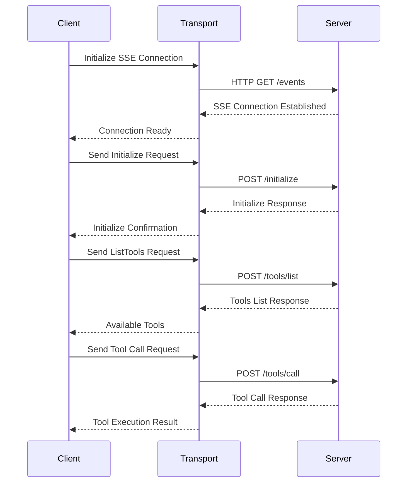

# Golang MCP Client

This repository provides a Go-based client library for the [Model Context Protocol (MCP)](https://example.com/)—an open standard that lets you connect AI systems with data sources in a consistent, scalable way. With this client, you can:

- Establish a transport layer using SSE.
- Connect to an MCP server.
- List and call available tools exposed via MCP
- Handle authentication and authoirization with the MCP server

## Overview

The MCP Client provides a way to interact with AI models using the Model Context Protocol. It supports:
- Tool discovery and listing
- Tool execution with arguments
- Server-Sent Events (SSE) based communication
- JSON-RPC 2.0 message format

## Architecture

The client is built with a modular architecture consisting of:

- **Transport Layer**: Handles the communication protocol (currently SSE)
- **Client Core**: Manages the MCP protocol implementation
- **Message Handling**: JSON-RPC 2.0 message serialization/deserialization

## Sequence Flow



## Getting Started

### Prerequisites

- Go 1.16 or higher
- Access to an MCP-compatible server

### Installation

```bash
git clone https://github.com/pyljain/mcp-go-client
```

### Usage

```go
package main

import (
    "log"
    "mcp_server/pkg/mcp"
    "mcp_server/pkg/transport"
)

func main() {
    // Initialize transport with server URL and auth headers
    transport := transport.NewSSETransport("http://localhost:8777", map[string]string{
        "Authorization": "Bearer your-token",
    })

    // Create new MCP client
    client := mcp.NewClient("your-client", "1.0.0")

    // Connect to server
    err := client.Connect(transport)
    if err != nil {
        log.Fatal(err)
    }

    // List available tools
    tools, err := client.ListTools()
    if err != nil {
        log.Fatal(err)
    }

    // Call a specific tool
    res, err := client.CallTool("tool-name", map[string]interface{}{
        "param1": "value1",
        "param2": "value2",
    })
    if err != nil {
        log.Fatal(err)
    }
}
```

## Protocol Details

### Message Format

The client uses JSON-RPC 2.0 for message exchange:

```json
// Request
{
    "jsonrpc": "2.0",
    "id": 1,
    "method": "tools/call",
    "params": {
        "name": "tool-name",
        "arguments": {
            "param1": "value1"
        }
    }
}

// Response
{
    "jsonrpc": "2.0",
    "id": 1,
    "result": {
        "content": [
            {
                "type": "text",
                "text": "response text"
            }
        ]
    }
}
```

### Transport

The client uses Server-Sent Events (SSE) for real-time communication:
- Establishes a persistent connection to the server
- Handles message streaming and reconnection
- Supports authentication through headers

### Authentication and Authorization

The MCP client supports authentication through HTTP headers. Here's how it works:

1. **Bearer Token Authentication**
   ```go
   transport := transport.NewSSETransport("http://localhost:8777", map[string]string{
       "Authorization": "Bearer abcd",  // Bearer token for authentication
   })
   ```
   The client sends the token in the `Authorization` header for both SSE connection and subsequent API calls.

2. **Header-based Authentication**
   You can add any custom headers required by your MCP server:
   ```go
   transport := transport.NewSSETransport("http://localhost:8777", map[string]string{
       "Authorization": "Bearer abcd",
       "X-Custom-Header": "custom-value",
       "X-API-Key": "your-api-key",
   })
   ```
   You will see the companion MCP Go Server validates the token being passed, in this case a synthetic value of 'abcd'. Review the [MCP Server Code](https://github.com/pyljain/mcp_server_go/blob/main/main.go#L16)

3. **Security Considerations**
   - Always use HTTPS for production environments
   - Store sensitive tokens securely (e.g., environment variables)
   - Rotate tokens regularly
   - Use the principle of least privilege for token permissions

4. **Error Handling**
   The client will return appropriate errors for authentication failures:
   - Invalid or expired tokens
   - Missing authentication headers
   - Unauthorized access attempts

## Error Handling

The client provides comprehensive error handling for:
- Connection failures
- Protocol errors
- Tool execution errors
- Message parsing errors

## Contributing

Contributions are welcome! Please feel free to submit a Pull Request.

## License

This project is licensed under the MIT License - see the LICENSE file for details.
